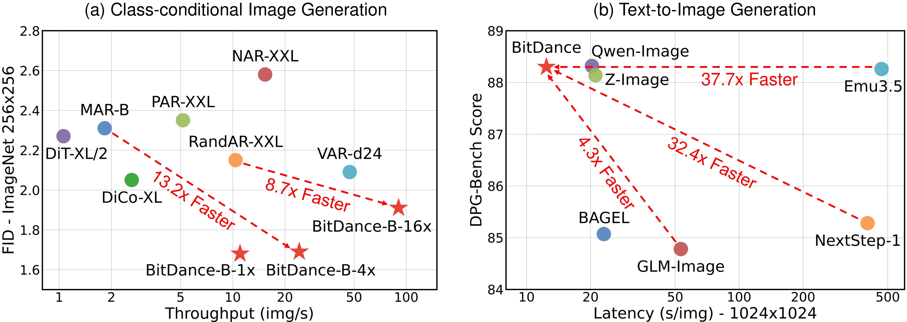
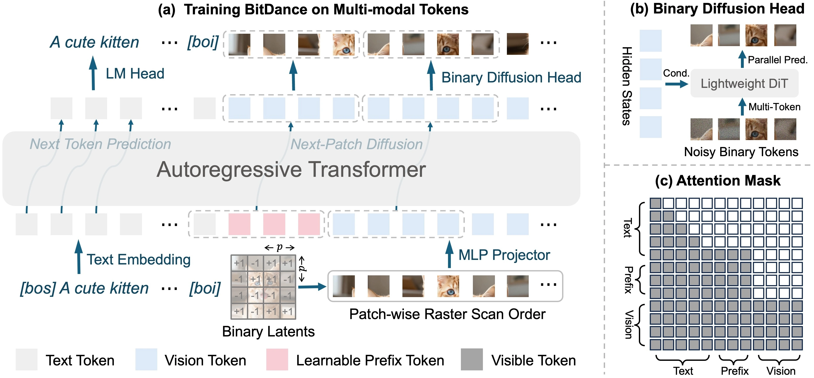

# BitDance: Scaling Autoregressive Generative Models with Binary Tokens 
 
<p align="center">
  <a href="https://bitdance.csuhan.com/">
    
  </a>
  <a href="TBD">
    
  </a>
  <a href="https://huggingface.co/collections/shallowdream204/bitdance">
    
  </a>
  <a href="https://huggingface.co/spaces/shallowdream204/BitDance-14B-64x">
    
  </a>
</p>

<p align="center"></p>


> [Yuang Ai*](https://shallowdream204.github.io/), [Jiaming Han*](https://csuhan.com/), [Shaobin Zhuang*](https://scholar.google.com/citations?user=PGaDirMAAAAJ), [Weijia Mao](https://scholar.google.com/citations?user=S7bGBmkyNtEC), [Xuefeng Hu](https://xuefenghu.me/), [Ziyan Yang](https://ziyanyang.github.io/), [Zhenheng Yang](https://zhenheny.github.io/), [Huaibo Huang†](https://hhb072.github.io/), [Xiangyu Yue†](https://xyue.io/), [Hao Chen*†‡](https://haochen-rye.github.io/)
>
> <sup>*</sup> Equal Contribution&nbsp;&nbsp;<sup>†</sup> Corresponding Author&nbsp;&nbsp;<sup>‡</sup> Project Lead
>
> For visual generation, discrete autoregressive models often struggle with poor tokenizer reconstruction, difficulties in sampling from large vocabularies, and slow token-by-token generation speeds. We present **BitDance**, which addresses these challenges via a large-vocabulary binary tokenizer, a binary diffusion head for sampling in large discrete space, and a next-patch diffusion paradigm that enables efficient multitoken prediction. BitDance is an open-source discrete autoregressive foundation model with 14B parameters, trained on large-scale multimodal tokens. While maintaining the standard language modeling paradigm for text tokens, BitDance employs a next-patch diffusion paradigm for visual tokens to predict multiple tokens in parallel—up to 64 per step. This unified multimodal framework is simple, scalable, and capable of efficiently generating high-resolution, photorealistic images.

<p align="center"></p>

## 🧠 Method
BitDance is a multimodal generative model featuring a purely autoregressive architecture. It adopts a simple decoder-only architecture, built upon three key components: **(i)** a large-vocabulary binary tokenizer, **(ii)** a binary diffusion head for sampling in extremely large discrete spaces, and **(iii)** a next-patch diffusion paradigm that enables efficient multi-token prediction.
BitDance is capable of predicting up to 64 visual tokens in parallel, offering a significant speed improvement over standard next-token prediction while maintaining excellent generation quality.

We scaled BitDance's capacity through Pre-training, Continued Training, and Supervised Finetuning on large-scale multimodal tokens. It surpasses open-source autoregressive models on multiple text-to-image generation benchmarks and achieves comparable performance to proprietary models and state-of-the-art diffusion models. Notably, BitDance achieves a speedup of over 30× compared to standard next-token prediction AR models.

<p align="center"></p>

## 🔥 News
- **2026.2.15**: We release **UniWeTok**, An Unified Binary Tokenizer with Codebook Size $\mathit{2^{128}}$ for Unified Multimodal Large Language Model. Checkout the **[UniWeTok README](README_UniWeTok.md)** for more details!
- **2026.2.15**: Code and models for class conditional generation on ImageNet are released! Check [here](imagenet_gen/README.md) for details.
- **2026.2.14**: Text-to-image inference code and models are released!


## ⚡ Quick Start

1️⃣ Create Conda Environment and Install Package
```bash
git clone https://github.com/shallowdream204/BitDance.git
cd BitDance
conda create -n bitdance python=3.11 -y
conda activate bitdance
pip install -r requirements.txt
pip install flash_attn==2.8.2 --no-build-isolation
```

2️⃣ Download Model Weights

We offer two models, BitDance-14B-64x and BitDance-14B-16x, which can predict 64 and 16 tokens in parallel at each step, respectively.
|  Model  | #Token per Step | Step (1024px) | Supported Size | Huggingface |
|:-------:|:----:|:----:|:-----------:|:----:|
| BitDance-14B-64x| 64 | 64 |1024px       | [BitDance-14B-64x](https://huggingface.co/shallowdream204/BitDance-14B-64x) |
| BitDance-14B-16x| 16 | 256 |512&1024px       | [BitDance-14B-16x](https://huggingface.co/shallowdream204/BitDance-14B-16x) |

Run the following scripts to download all models.

```bash
hf download shallowdream204/BitDance-14B-64x --local-dir models/BitDance-14B-64x --max-workers=16
hf download shallowdream204/BitDance-14B-16x --local-dir models/BitDance-14B-16x --max-workers=16
```

3️⃣ T2I Inference (check [here](modeling/t2i_pipeline.py#L21) for the supported image resolution)
```python
# example_t2i.py
from modeling.t2i_pipeline import BitDanceT2IPipeline

model_path = 'models/BitDance-14B-64x'
# model_path = 'models/BitDance-14B-16x'
device = 'cuda'

pipe = BitDanceT2IPipeline(model_path=model_path, device=device)

prompt = "A close-up portrait in a cinematic photography style, capturing a girl-next-door look on a sunny daytime urban street. She wears a khaki sweater, with long, flowing hair gently draped over her shoulders. Her head is turned slightly, revealing soft facial features illuminated by realistic, delicate sunlight coming from the left. The sunlight subtly highlights individual strands of her hair. The image has a Canon film-like color tone, evoking a warm nostalgic atmosphere."

image = pipe.generate(
    prompt=prompt,
    height=1024,
    width=1024,
    num_sampling_steps=50, # may adjust to 25 steps for faster inference, but may slightly reduce quality
    guidance_scale=7.5,
    num_images=1,
    seed=42
)[0]

image.save("example.png")
```

## 🤗 Demo

🔥 Try the Huggingface Space demo to start playing with BitDance: [BitDance-Demo](https://huggingface.co/spaces/shallowdream204/BitDance-14B-64x)

You can also run the demo locally:
```bash
python app.py
```

## 📸 Evaluation
We provide the scripts for evaluation on DPG Bench and GenEval. More benchmark evaluation scripts are coming soon.

1️⃣ Evaluation of BitDance-14B-64x Model
```bash
bash scripts/eval/eval_bitdance_14b_64x.sh
```
2️⃣ Evaluation of BitDance-14B-16x Model

```bash
bash scripts/eval/eval_bitdance_14b_16x.sh
```

Note you still need to follow the instructions in [DPG Bench](https://github.com/TencentQQGYLab/ELLA#-dpg-bench) and [GenEval](https://github.com/djghosh13/geneval) to evaluate the results.

## 🎰 Train
We are organizing the code related to data loading. The training instruction of BitDance is coming soon.

## 📊 Model Performance
<div style="overflow-x: auto; margin-bottom: 16px;">
  <table style="border-collapse: collapse; width: 100%;">
    <thead>
      <tr>
        <th style="white-space: nowrap; padding: 8px; border: 1px solid #d0d7de; background-color: #f6f8fa;" rowspan="2">Model</th>
        <th style="white-space: nowrap; padding: 8px; border: 1px solid #d0d7de; background-color: #f6f8fa;" rowspan="2">Open Source</th>
        <th style="white-space: nowrap; padding: 8px; border: 1px solid #d0d7de; background-color: #f6f8fa;" rowspan="2">DPG-Bench</th>
        <th style="white-space: nowrap; padding: 8px; border: 1px solid #d0d7de; background-color: #f6f8fa;" rowspan="2">GenEval</th>
        <th style="padding: 8px; border: 1px solid #d0d7de; background-color: #f6f8fa; text-align: center;" colspan="2">OneIG-Bench</th>
        <th style="padding: 8px; border: 1px solid #d0d7de; background-color: #f6f8fa; text-align: center;" colspan="2">TIIF-Bench</th>
      </tr>
      <tr>
        <th style="white-space: nowrap; padding: 8px; border: 1px solid #d0d7de; background-color: #f6f8fa; text-align: center;">EN</th>
        <th style="white-space: nowrap; padding: 8px; border: 1px solid #d0d7de; background-color: #f6f8fa; text-align: center;">ZH</th>
        <th style="white-space: nowrap; padding: 8px; border: 1px solid #d0d7de; background-color: #f6f8fa; text-align: center;">short</th>
        <th style="white-space: nowrap; padding: 8px; border: 1px solid #d0d7de; background-color: #f6f8fa; text-align: center;">long</th>
      </tr>
    </thead>
    <tbody>
      <tr>
        <td style="padding: 8px; border: 1px solid #d0d7de; white-space:nowrap;">GPT Image 1</td>
        <td style="padding: 8px; border: 1px solid #d0d7de; text-align: center;">✗</td>
        <td style="padding: 8px; border: 1px solid #d0d7de; text-align: center;">85.15</td>
        <td style="padding: 8px; border: 1px solid #d0d7de; text-align: center;">0.84</td>
        <td style="padding: 8px; border: 1px solid #d0d7de; text-align: center;">0.533</td>
        <td style="padding: 8px; border: 1px solid #d0d7de; text-align: center;">0.474</td>
        <td style="padding: 8px; border: 1px solid #d0d7de; text-align: center;">89.15</td>
        <td style="padding: 8px; border: 1px solid #d0d7de; text-align: center;">88.29</td>
      </tr>
      <tr>
        <td style="padding: 8px; border: 1px solid #d0d7de; white-space:nowrap;">Seedream 3.0</td>
        <td style="padding: 8px; border: 1px solid #d0d7de; text-align: center;">✗</td>
        <td style="padding: 8px; border: 1px solid #d0d7de; text-align: center;">88.27</td>
        <td style="padding: 8px; border: 1px solid #d0d7de; text-align: center;">0.84</td>
        <td style="padding: 8px; border: 1px solid #d0d7de; text-align: center;">0.530</td>
        <td style="padding: 8px; border: 1px solid #d0d7de; text-align: center;">0.528</td>
        <td style="padding: 8px; border: 1px solid #d0d7de; text-align: center;">86.02</td>
        <td style="padding: 8px; border: 1px solid #d0d7de; text-align: center;">84.31</td>
      </tr>
      <tr>
        <td style="padding: 8px; border: 1px solid #d0d7de; white-space:nowrap;">Qwen-Image</td>
        <td style="padding: 8px; border: 1px solid #d0d7de; text-align: center;">✓</td>
        <td style="padding: 8px; border: 1px solid #d0d7de; text-align: center;">88.32</td>
        <td style="padding: 8px; border: 1px solid #d0d7de; text-align: center;">0.87</td>
        <td style="padding: 8px; border: 1px solid #d0d7de; text-align: center;">0.539</td>
        <td style="padding: 8px; border: 1px solid #d0d7de; text-align: center;">0.548</td>
        <td style="padding: 8px; border: 1px solid #d0d7de; text-align: center;">86.14</td>
        <td style="padding: 8px; border: 1px solid #d0d7de; text-align: center;">86.83</td>
      </tr>
      <tr>
        <td style="padding: 8px; border: 1px solid #d0d7de; white-space:nowrap;">Z-Image</td>
        <td style="padding: 8px; border: 1px solid #d0d7de; text-align: center;">✓</td>
        <td style="padding: 8px; border: 1px solid #d0d7de; text-align: center;">88.14</td>
        <td style="padding: 8px; border: 1px solid #d0d7de; text-align: center;">0.84</td>
        <td style="padding: 8px; border: 1px solid #d0d7de; text-align: center;">0.546</td>
        <td style="padding: 8px; border: 1px solid #d0d7de; text-align: center;">0.535</td>
        <td style="padding: 8px; border: 1px solid #d0d7de; text-align: center;">80.20</td>
        <td style="padding: 8px; border: 1px solid #d0d7de; text-align: center;">83.01</td>
      </tr>
      <tr>
        <td style="padding: 8px; border: 1px solid #d0d7de; white-space:nowrap;">Z-Image-Turbo</td>
        <td style="padding: 8px; border: 1px solid #d0d7de; text-align: center;">✓</td>
        <td style="padding: 8px; border: 1px solid #d0d7de; text-align: center;">84.86</td>
        <td style="padding: 8px; border: 1px solid #d0d7de; text-align: center;">0.82</td>
        <td style="padding: 8px; border: 1px solid #d0d7de; text-align: center;">0.528</td>
        <td style="padding: 8px; border: 1px solid #d0d7de; text-align: center;">0.507</td>
        <td style="padding: 8px; border: 1px solid #d0d7de; text-align: center;">77.73</td>
        <td style="padding: 8px; border: 1px solid #d0d7de; text-align: center;">80.05</td>
      </tr>
      <tr>
        <td style="padding: 8px; border: 1px solid #d0d7de; white-space:nowrap;">FLUX.1 [Dev]</td>
        <td style="padding: 8px; border: 1px solid #d0d7de; text-align: center;">✓</td>
        <td style="padding: 8px; border: 1px solid #d0d7de; text-align: center;">83.84</td>
        <td style="padding: 8px; border: 1px solid #d0d7de; text-align: center;">0.66</td>
        <td style="padding: 8px; border: 1px solid #d0d7de; text-align: center;">0.434</td>
        <td style="padding: 8px; border: 1px solid #d0d7de; text-align: center;">-</td>
        <td style="padding: 8px; border: 1px solid #d0d7de; text-align: center;">71.09</td>
        <td style="padding: 8px; border: 1px solid #d0d7de; text-align: center;">71.78</td>
      </tr>
      <tr>
        <td style="padding: 8px; border: 1px solid #d0d7de; white-space:nowrap;">BAGEL</td>
        <td style="padding: 8px; border: 1px solid #d0d7de; text-align: center;">✓</td>
        <td style="padding: 8px; border: 1px solid #d0d7de; text-align: center;">85.07</td>
        <td style="padding: 8px; border: 1px solid #d0d7de; text-align: center;">0.88</td>
        <td style="padding: 8px; border: 1px solid #d0d7de; text-align: center;">0.361</td>
        <td style="padding: 8px; border: 1px solid #d0d7de; text-align: center;">0.370</td>
        <td style="padding: 8px; border: 1px solid #d0d7de; text-align: center;">71.50</td>
        <td style="padding: 8px; border: 1px solid #d0d7de; text-align: center;">71.70</td>
      </tr>
      <tr>
        <td style="padding: 8px; border: 1px solid #d0d7de; white-space:nowrap;">Infinity</td>
        <td style="padding: 8px; border: 1px solid #d0d7de; text-align: center;">✓</td>
        <td style="padding: 8px; border: 1px solid #d0d7de; text-align: center;">83.46</td>
        <td style="padding: 8px; border: 1px solid #d0d7de; text-align: center;">0.73</td>
        <td style="padding: 8px; border: 1px solid #d0d7de; text-align: center;">-</td>
        <td style="padding: 8px; border: 1px solid #d0d7de; text-align: center;">-</td>
        <td style="padding: 8px; border: 1px solid #d0d7de; text-align: center;">62.07</td>
        <td style="padding: 8px; border: 1px solid #d0d7de; text-align: center;">62.32</td>
      </tr>
      <tr>
        <td style="padding: 8px; border: 1px solid #d0d7de; white-space:nowrap;">Janus-Pro</td>
        <td style="padding: 8px; border: 1px solid #d0d7de; text-align: center;">✓</td>
        <td style="padding: 8px; border: 1px solid #d0d7de; text-align: center;">84.19</td>
        <td style="padding: 8px; border: 1px solid #d0d7de; text-align: center;">0.80</td>
        <td style="padding: 8px; border: 1px solid #d0d7de; text-align: center;">0.267</td>
        <td style="padding: 8px; border: 1px solid #d0d7de; text-align: center;">0.240</td>
        <td style="padding: 8px; border: 1px solid #d0d7de; text-align: center;">66.50</td>
        <td style="padding: 8px; border: 1px solid #d0d7de; text-align: center;">65.01</td>
      </tr>
      <tr>
        <td style="padding: 8px; border: 1px solid #d0d7de; white-space:nowrap;">Show-o2</td>
        <td style="padding: 8px; border: 1px solid #d0d7de; text-align: center;">✓</td>
        <td style="padding: 8px; border: 1px solid #d0d7de; text-align: center;">86.14</td>
        <td style="padding: 8px; border: 1px solid #d0d7de; text-align: center;">0.76</td>
        <td style="padding: 8px; border: 1px solid #d0d7de; text-align: center;">0.308</td>
        <td style="padding: 8px; border: 1px solid #d0d7de; text-align: center;">-</td>
        <td style="padding: 8px; border: 1px solid #d0d7de; text-align: center;">59.72</td>
        <td style="padding: 8px; border: 1px solid #d0d7de; text-align: center;">58.86</td>
      </tr>
      <tr>
        <td style="padding: 8px; border: 1px solid #d0d7de; white-space:nowrap;">NextStep-1</td>
        <td style="padding: 8px; border: 1px solid #d0d7de; text-align: center;">✓</td>
        <td style="padding: 8px; border: 1px solid #d0d7de; text-align: center;">85.28</td>
        <td style="padding: 8px; border: 1px solid #d0d7de; text-align: center;">0.73</td>
        <td style="padding: 8px; border: 1px solid #d0d7de; text-align: center;">0.418</td>
        <td style="padding: 8px; border: 1px solid #d0d7de; text-align: center;">-</td>
        <td style="padding: 8px; border: 1px solid #d0d7de; text-align: center;">-</td>
        <td style="padding: 8px; border: 1px solid #d0d7de; text-align: center;">-</td>
      </tr>
      <tr>
        <td style="padding: 8px; border: 1px solid #d0d7de; white-space:nowrap;">GLM-Image</td>
        <td style="padding: 8px; border: 1px solid #d0d7de; text-align: center;">✓</td>
        <td style="padding: 8px; border: 1px solid #d0d7de; text-align: center;">84.78</td>
        <td style="padding: 8px; border: 1px solid #d0d7de; text-align: center;">-</td>
        <td style="padding: 8px; border: 1px solid #d0d7de; text-align: center;">0.528</td>
        <td style="padding: 8px; border: 1px solid #d0d7de; text-align: center;">0.511</td>
        <td style="padding: 8px; border: 1px solid #d0d7de; text-align: center;">81.01</td>
        <td style="padding: 8px; border: 1px solid #d0d7de; text-align: center;">81.02</td>
      </tr>
      <tr>
        <td style="padding: 8px; border: 1px solid #d0d7de; white-space:nowrap;font-weight:bold;">BitDance</td>
        <td style="padding: 8px; border: 1px solid #d0d7de; text-align: center;">✓</td>
        <td style="padding: 8px; border: 1px solid #d0d7de; text-align: center;">88.28</td>
        <td style="padding: 8px; border: 1px solid #d0d7de; text-align: center;">0.86</td>
        <td style="padding: 8px; border: 1px solid #d0d7de; text-align: center;">0.532</td>
        <td style="padding: 8px; border: 1px solid #d0d7de; text-align: center;">0.512</td>
        <td style="padding: 8px; border: 1px solid #d0d7de; text-align: center;">79.64</td>
        <td style="padding: 8px; border: 1px solid #d0d7de; text-align: center;">78.12</td>
      </tr>
    </tbody>
  </table>
</div>


## 🪪 License

BitDance is licensed under the [Apache 2.0 license](LICENSE).

## 📖 Citation
If you find our work useful for your research, please consider citing our paper:
```bibtex
@article{ai2026bitdance,
  title   = {BitDance: Scaling Autoregressive Generative Models with Binary Tokens},
  author  = {Ai, Yuang and Han, Jiaming and Zhuang, Shaobin and Hu, Xuefeng and Yang, Ziyan and Yang, Zhenheng and Huang, Huaibo and Yue, Xiangyu and Chen, Hao},
  journal = {TBD},
  year    = {2026}
}
```