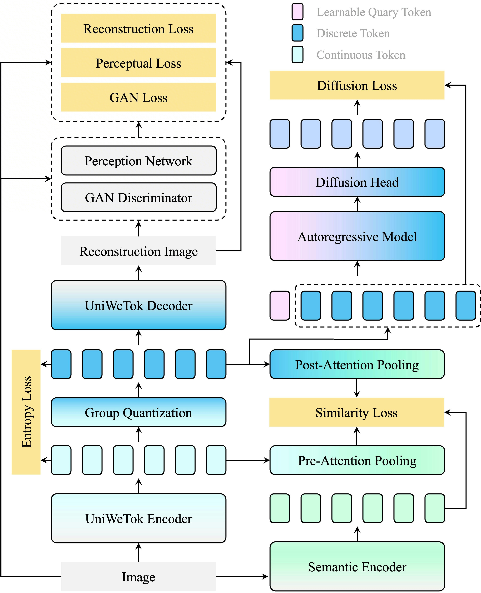

# UniWeTok: An Unified Binary Tokenizer with Codebook Size $\mathit{2^{128}}$ for Unified Multimodal Large Language Model

<p align="center">
  <a href="https://arxiv.org/abs/submit/7270557">
    
  </a>
  <a href="https://huggingface.co/collections/shallowdream204/uniwetok">
    
  </a>
</p>

<p align="center"></p>

> [Shaobin Zhuang*](https://scholar.google.com/citations?user=PGaDirMAAAAJ), [Yuang Ai*](https://shallowdream204.github.io/), [Jiaming Han*](https://csuhan.com/), [Weijia Mao](https://scholar.google.com/citations?user=S7bGBmkyNtEC), [Xiaohui Li](https://scholar.google.com/citations?hl=zh-CN&user=QqZYCEIAAAAJ), [Fangyikang Wang](https://scholar.google.com/citations?hl=zh-CN&user=j80akcEAAAAJ), [Xiao Wang](https://xiaowang.org/), [Yan Li](), [Shanchuan Lin](https://scholar.google.com/citations?hl=en&user=EDWUw7gAAAAJ), [Kun Xu](https://scholar.google.com/citations?user=MGTIEMIAAAAJ&hl=en), [Zhenheng Yang](https://scholar.google.com/citations?hl=en&user=Ds5wwRoAAAAJ), [Huaibo Huang](https://hhb072.github.io/), [Xiangyu Yue](https://xyue.io/), [Hao Chen*†‡](https://haochen-rye.github.io/), [Yali Wang†](https://scholar.google.com/citations?hl=en&user=hD948dkAAAAJ)
>
> <sup>*</sup> Equal Contribution&nbsp;&nbsp;<sup>†</sup> Corresponding Author;<sup>‡</sup> Project Lead
>
> Unified Multimodal Large Language Models (MLLMs) require a visual representation that simultaneously supports high-fidelity reconstruction, complex semantic extraction, and generative suitability. However, existing visual tokenizers typically struggle to satisfy these conflicting objectives within a single framework. In this paper, we introduce UniWeTok, a unified discrete tokenizer designed to bridge this gap using a massive binary codebook ($\mathit{2^{128}}$). For training framework, we introduce Pre-Post Distillation and a Generative-Aware Prior to enhance the semantic extraction and generative prior of the discrete tokens. In terms of model architecture, we propose a convolution-attention hybrid architecture with the SigLu activation function. SigLu activation not only bounds the encoder output and stabilizes the semantic distillation process but also effectively addresses the optimization conflict between token entropy loss and commitment loss. We further propose a three-stage training framework designed to enhance UniWeTok's adaptability cross various image resolutions and perception-sensitive scenarios, such as those involving human faces and textual content. On ImageNet, UniWeTok achieves state-of-the-art image generation performance (FID: UniWeTok 1.38 vs. REPA 1.42) while requiring a remarkably low training compute (Training Tokens: UniWeTok 33B vs. REPA 262B). On general-domain, UniWeTok demonstrates highly competitive capabilities across a broad range of tasks, including multimodal understanding, image generation (DPG Score: UniWeTok 86.63 vs. FLUX.1 [Dev] 83.84), and editing (GEdit Overall Score: UniWeTok 5.09 vs. OmniGen 5.06). We release code and models to facilitate community exploration of unified tokenizer and MLLM.


## ⚡ Highlights
- **Extreme Compression**: Compresses 256x256 images into just **64 tokens** (32x downsampling), reducing sequence length by 75% compared to standard tokenizers.
- **Massive Codebook**: Uses a binary codebook of size **$2^{128}$** via Group-Wise Lookup-Free Quantization.
- **Unified Capability**: Excels at both **Generation** (DPG Score 86.63 vs FLUX.1 [Dev] 83.84) and **Understanding** (Competitive on MMMU, MME).
- **Efficiency**: Requires remarkably low training compute (33B tokens vs 262B for comparable methods).

<p align="center"></p>

<!-- ## ⚡ Quick Start -->

<!-- ### 1️⃣ Installation
UniWeTok shares the same environment as BitDance. If you haven't installed it yet:

```bash
git clone [https://github.com/shallowdream204/BitDance.git](https://github.com/shallowdream204/BitDance.git)
cd BitDance
conda create -n bitdance python=3.11 -y
conda activate bitdance
pip install -r requirements.txt
pip install flash_attn==2.8.2 --no-build-isolation
``` -->


## 🪪 License

UniWeTok is licensed under the [Apache 2.0 license](LICENSE).

## 📖 Citation
If you find our work useful for your research, please consider citing our paper:
```bibtex
@article{zhuang2026uniwetok,
  title   = {UniWeTok: An Unified Binary Tokenizer with Codebook Size $\mathit{2^{128}}$ for Unified Multimodal Large Language Model},
  author  = {Zhuang, Shaobin and Ai, Yuang and Han, Jiaming and Mao, Weijia and Li, Xiaohui and Wang, Fangyikang and Wang, Xiao and Li, Yan and Lin, Shanchuan and Xu, Kun and Yang, Zhenheng and Huang, Huaibo and Yue, Xiangyu and Chen, Hao and Wang, Yali},
  journal = {TBD},
  year    = {2026}
}
```